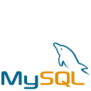

<a id="php-unit-tests"></a>

<div align="center">

[](#php-unit-tests)

</div>

<!-- 
    icons by:
    https://devicon.dev/
    https://simpleicons.org/
-->
[](https://www.php.net) [](https://getcomposer.org/) [](https://ubuntu.com/) [](https://github.com/jtonynet) [](https://code.visualstudio.com/) 


<!--
[](https://laravel.com/)  [](https://www.mysql.com/) [](https://redis.com/) [](https://www.docker.com/) [](https://kubernetes.io/) [](https://swagger.io/) [](https://https://miro.com/) [](https://mermaid.js.org/) [](https://docs.github.com/en/actions) [](https://gatling.com/) [](https://prometheus.io/) [](https://grafana.com/)  [](https://grafana.com/oss/loki/) 
--> 


 <!---->

---

## 🕸️ Encontre-me na Web

[](https://www.linkedin.com/in/jos%C3%A9-r-99896a39/) [](https://dev.to/learningenuity) [](mailto:learningenuity@gmail.com) 
---

## 📁 O Projeto

<a id="index"></a>
### ⤴️ Index

__[Laravel CRUD Series](#php-unit-tests)__<br/>
  1. ⤴️ [Index](#index)
  2. 📗 [Sobre](#about)
  3. 💻 [Rodando o Projeto](#run)
  4. 🔢 [Versões](#versions)
  5. 🤖 [Use de AI](#ia)
  6. 🏁 [Conclusão](#conclusion)
 
<br/>

---

<a id="about"></a>
### 📗 Sobre

Repositório puramente didático, baseado no curso [Boas Práticas em PHP](https://cursos.alura.com.br/formacao-boas-praticas-php) da Alura, com a finalidade de revisar e atualizar meus conhecimentos na linguagem, bem como nas práticas adequadas e recomendadas para um bom desenvolvimento com ela.

A aplicação base foi diretamente baixada do repositório do curso para que os testes possam ser aplicados.

Também busco explorar melhorias na versão atual da linguagem, sempre que possível, adaptando códigos, mesmo que estejam fora do escopo inicial do curso.

<br/>

Projeto do Curso:
- `Testes de Unidade` da `API de Leilão` com [`PHPUnit`](https://phpunit.de/index.html)


<br/>

<div align="center">
  
</div>

<br/>

[⤴️ de volta ao Index](#index)

---

<a id="run"></a>
### 💻 Rodando o Projeto

**TODO**

<br/>

[⤴️ de volta ao Index](#index)

---

<a id="versions"></a>
### 🔢 Versões

As tags de versões estão sendo criadas manualmente a medida que o curso avança. Cada módulo é desenvolvido em uma branch a parte (Branch Based, [feature branch](https://www.atlassian.com/git/tutorials/comparing-workflows/feature-branch-workflow)) quando finalizadas é gerada tag e mergeadas em main.

<br/>

[⤴️ de volta ao Index](#index)

---

<a id="ia"></a>
### 🤖 Uso de AI

As figuras do cabeçalho nesta página foram criadas com a ajuda de inteligência artificial e um mínimo de retoques e construção no Gimp [](https://www.gimp.org/)


__Os seguintes prompts foram usados para criação no  [Bing IA:](https://www.bing.com/images/create/)__


<details>
  <summary><b>Elefante Estudante fazendo um Teste</b></summary>
"um elefante azul, simbolo da linguagem de programação PHP, ANTROPOMÓRFICO sentado em um banco de escola fazendo um teste, como se fosse um estudante do ensino medio. Corpo Inteiro. Estilo cartoon, fundo branco para fácil remoção, cores chapadas"<b>(sic)</b>
</details>

<br/>

A IA também ajudou em algumas pesquisas neste estudo, sendo utilizada como uma ferramenta de apoio; no entanto, __arte e desenvolvimento são, acima de tudo, atividades criativas humanas. Valorize as pessoas!__

Contrate artistas para projetos comerciais ou mais elaborados e aprenda a ser engenhoso!


<br/>

[⤴️ de volta ao Index](#index)

---

<a id="conclusion"></a>
### 🏁 Conclusão

__TODO__


<br/>

[⤴️ de volta ao Index](#index)

---

<a id="footer"></a>

<br/>

>  _"Lifelong Learning & Prosper"_
> <br/> 
>  _Mr. Spock, maybe_   🖖🏾🚀

<div align="center">
    <a href="#footer">
        
    </a>
</div>


<!--  

TODO: Finalidade didatica. Levar para Wiki/Confluence/Obsidian comum


PHPUnit no PHP 8.1 ou superior:
```bash
composer require --dev phpunit/phpunit ^10
```

Instalando phpcs globalmente
```bash
composer global require "squizlabs/php_codesniffer=*"
```

Pressione `Ctrl + ,` pesquise por `php`, clique nele e depois no link 
`editar em settings.json` e adicione a seguinte linha ao final do settings.json
```json
 "phpcs.executablePath": "/home/jtony/.config/composer/vendor/bin/phpcs"
```

Crie um arquivo (ou use um do projeto) com as definicoes do phpcs chamado
`phpcs.xml` e entao execute o seguinte comando:
```bash
phpcs --standard=phpcs.xml .
```


RODANDO TESTES:
```bash
./vendor/bin/phpunit --colors tests
 ```
-->